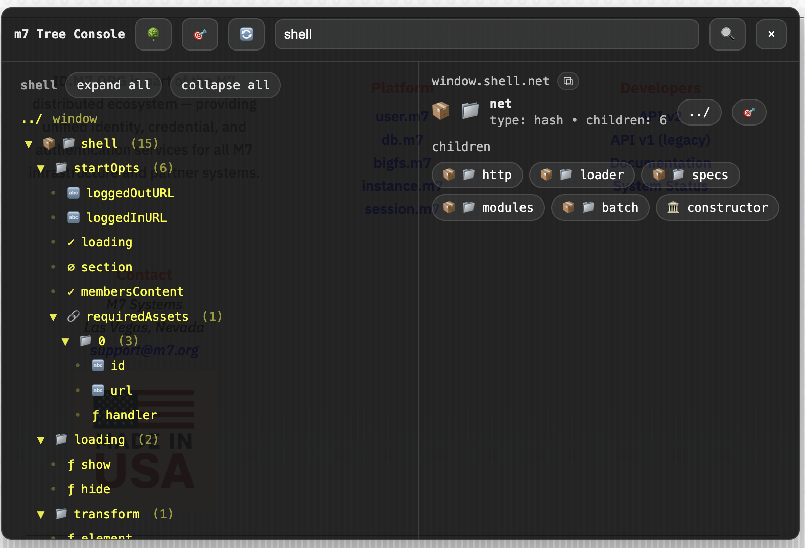

# m7-js-lib-tree

**Runtime JavaScript Tree Inspector & Console**

A lightweight developer tool for **exploring, scanning, and reverse‑engineering large JavaScript object graphs at runtime**. Designed for the **M7 library ecosystem**, but fully usable as a standalone inspector for any JavaScript object.

---

## 🔍 Overview

M7 represents **over 25 years of accumulated JavaScript libraries** — modular, battle‑tested, and still actively used. The ecosystem favors:

* incremental runtime loading
* large, composable APIs
* reuse over reinvention

Over time, this produces **very large object graphs** that are difficult to reason about using traditional tooling.

**m7-js-tree** exists to make it easy to **find what already exists**.

The goal is not deep static analysis, but **rapid discovery**:

* locate functions, utilities, and subsystems
* browse API surfaces when documentation is missing or outdated
* inspect runtime‑assembled structures
* avoid rewriting code that already exists

This tool reflects **what is actually loaded at runtime**, but the inspected tree represents a **static snapshot** of that state until **Reparse** is explicitly triggered — which is critical for safely exploring large, on‑demand systems.

---

## 🧪 Intended Use Cases

* Exploring undocumented or legacy APIs
* Rapidly locating functions, utilities, and classes without guessing in a console
* Inspecting large libraries on **mobile devices** where a developer console is unavailable or impractical
* Copying stable object paths quickly for reuse, documentation, or debugging
* Navigating complex runtime‑assembled graphs more reliably than ad‑hoc `console.log`
* Working around browser dev‑console limitations (clutter, instability, excessive memory use)
* Lightweight, on‑demand inspection that can be enabled during development and removed for production
* Internal developer tooling

---

## 🖥 Usage

Open the console by calling:

```js
lib.tree.console(path);
```

Where `path` can be **any object or dot‑path** you want to inspect. You can change or reset this later.

### Controls

* **`~` or <code>`</code>** — open / close the console panel
* **Target** — sets the base path (root) for inspection
* **Reparse** (top bar) — re‑parses the current target
* **Tree** — opens the tree navigation menu
* **Copy path / Copy value** — copies the selected node’s path or value

### Navigation

* **`../` (tree view)** — changes the current root path
* **`../` (detail view)** — navigates upward *within* the current path



---

## 📦 Installation

### Option 1: With M7 libraries (recommended, explicit install)

```js
import lib, { init } from "/vendor/m7-js-lib/src/index.js";
import installTree from "/vendor/m7-js-lib-tree/src/install.js";

init();
installTree(lib);

lib.tree.console(lib);
```

---

### Option 2: Explicit extension factory (`make(lib)`)

```js
import lib, { init } from "/vendor/m7-js-lib/src/index.js";
import makeTree from "/vendor/m7-js-lib-tree/src/tree.js";

init();

const tree = makeTree(lib); // explicit lib injection
lib.hash.set(lib, "tree", tree); // optional manual registration

tree.console(lib);
```

`src/tree.js` is the extension module contract:

* Exports `make(lib)` to build the namespace.
* Requires an explicit `lib` instance.
* Does not read `window.lib` / `globalThis.lib`.

---

### Option 3: Legacy/global convenience (`auto.js`)

```html
<script type="module" src="https://static.m7.org/vendor/m7-js-lib-tree/src/auto.js"></script>
```

If global `lib` exists, `auto.js` installs `lib.tree`. If it does not exist, the shim warns and safely no-ops.

`auto.js` is the only integration entrypoint in this package that intentionally reads global `lib`.

---

### Option 4: Standalone / direct import

```js
import { openConsole } from "./src/TreeInspector.js";

openConsole(globalThis); // or any object
```

No bootstrap or framework required.

---

### Entry points at a glance

* `src/tree.js` -> `make(lib)` extension builder (no global fallback).
* `src/install.js` -> registers the built namespace at `lib.tree`.
* `src/auto.js` -> legacy shim for global `lib` environments (intentional global read).
* `src/TreeInspector.js` -> standalone inspector/console exports (non-lib path).
* `src/tree.js` wrapper exports (`openConsole`, `inspector`, `printTree`) require prior `make(lib)` / `install(lib)`.

---

## 🔒 Global Access Policy

For m7 extension hygiene and migration toward stricter module boundaries:

* `src/auto.js` is the only file that may read global `lib` (`globalThis.lib` style shim behavior).
* `src/install.js` requires explicit `install(lib, opts?)` input and does not resolve global `lib`.
* `src/tree.js` requires explicit `make(lib)` input and does not resolve global `lib`.
* Console/runtime modules operate via explicit context (`ctx.lib`) rather than global mutation.
* Package manager glue no longer writes `window.lib`.

Use `install(lib)` or `make(lib)` for professional/module setups; use `auto.js` only for legacy global boot flows.

---

## ✅ Requirements

* **Required:** modern browser with ES module support
* **Optional:** `m7-js-lib` for extension registration and integration

This tool does **not** require M7 libraries — any JavaScript object can be inspected.

---

## 🧠 How It Works

m7-js-tree traverses live JavaScript values and produces an enriched tree representation of:

* objects / hashes
* arrays
* functions
* classes
* scalar values
* circular references

The resulting structure can be used as:

* a collapsible navigation tree
* a searchable index
* an inspection surface for functions and classes

The inline console UI is intentionally minimal and dependency‑free, designed for **debugging, archaeology, and discovery** rather than end‑user presentation.

---

## 🛠 Current Features

* Runtime tree parsing
* Collapsible tree view
* Absolute path‑based inspection
* Substring & predicate search (`find`)
* Function signature extraction
* Circular reference detection
* Inline DOM console (toggleable)
* Works with `window` / `globalThis` and any explicitly provided object root

---

## 🧭 Roadmap

* Improved UI and keyboard navigation

* Optional persistence of tree state

* Linking nodes to external documentation

* Repository‑backed package search via **m7BootStrap**

---

## 📜 License

See [`LICENSE.md`](LICENSE.md) for full terms.

* Free for personal, non‑commercial use
* Commercial licensing available under the **M7 Moderate Team License (MTL‑10)**

---

## 🤖 AI Usage Disclosure

See:

* [`docs/AI_DISCLOSURE.md`](docs/AI_DISCLOSURE.md)
* [`docs/USE_POLICY.md`](docs/USE_POLICY.md)

For permitted use of AI in derivative tools or automation layers.

---

## 📬 Contact

**Author & Maintainer:** M7 Development Team

* **Website:** [https://m7.org](https://m7.org)
* **Email:** [support@m7.org](mailto:support@m7.org)
* **Legal:** [legal@m7.org](mailto:legal@m7.org)
* **Security:** [security@m7.org](mailto:security@m7.org)
* **GitHub:** [https://github.com/linearblade](https://github.com/linearblade)
